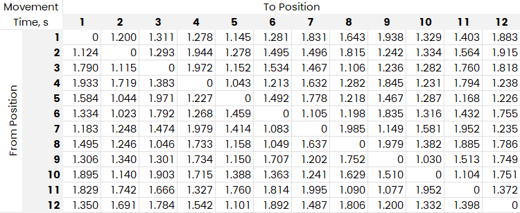

# Travelling-Salesman-NDT
Asymmetric Traveling Salesman Problem (ATSP) and solutions

Test data generator:

```python
import numpy as np

def generate_cost_matrix(size, low=1.0, high=2.0, filename="cost_matrix.csv"):
    mat = np.random.uniform(low, high, (size, size)) # Generate random floats
    np.fill_diagonal(mat, 0.0) # Set diagonal to zero
    mat_str = np.vectorize(lambda x: f"{x:.3f}")(mat) # Format each value
    with open(filename, "w") as f:
        for row in mat_str:
            f.write(";".join(row) + "\n") # Write to file with semicolon sep.

# Generate for 12 and 60 positions
generate_cost_matrix(12, filename="cost_matrix_12.csv")
generate_cost_matrix(60, filename="cost_matrix_60.csv")
```

Example for 12 positions:



## Results for 12 and 60 Positions:

| Algorithm                        | 12 Positions  | 60 Positions      |
| -------------------------------- | ------------- | ----------------- |
| Sequential (unoptimized)         | 16.925        | *90.716*          |
| Optimal Inspection (Brute Force) | **13.621**    | - Not feasible :( |
| Greedy Algorithm                 | 14.107        | 65.598            |
| Simulated Annealing              | 14.534/14.213 | 71.737/75.718     |
| Ant Colony Optimization          | **13.621**    | 65.638/65.803     |
| Tabu Search                      | 13.714        | **64.905**        |
| Lin-Kernighan (2-opt)            | 13.923        | 74.299            |
| Genetic Algorithm                | 14.098/13.929 | 69.602/67.818     |

## Solutiuons

Different Algorithms Collection:

### Brute Force Method (max up to 12-13 positions):

```Python
def solve_brute_force(distance_matrix):
    n = len(distance_matrix)
    cities = list(range(1, n))
    min_cost = float('inf')
    optimal_route = []

    for perm in itertools.permutations(cities):
        route = [0] + list(perm) + [0]  # start and end at city 0
        cost = sum(distance_matrix[route[i]][route[i+1]] for i in range(n))
        if cost < min_cost:
            min_cost = cost
            optimal_route = route

    return optimal_route, min_cost
```

### Greedy Algorithm:

```python
def solve_tsp_greedy(matrix):
    n = len(matrix)
    inspected = [False] * n
    path = [0]
    inspected[0] = True
    total_cost = 0

    for _ in range(n - 1):
        last = path[-1]
        next_pos = np.argmin([matrix[last][j] if not inspected[j] else np.inf for j in range(n)])
        path.append(next_pos)
        inspected[next_pos] = True
        total_cost += matrix[last][next_pos]

    total_cost += matrix[path[-1]][path[0]]
    path.append(path[0])
    route = [int(x) for x in path]
    return route, total_cost
```

### Simulated Annealing solver:

```python
def simulated_annealing(distance_matrix, initial_temp=1000, cooling_rate=0.995, stop_temp=1e-8):
    n = len(distance_matrix)
    current = list(range(n)) + [0]
    best = current[:]
    current_cost = total_distance(current, distance_matrix)
    best_cost = current_cost
    temp = initial_temp

    while temp > stop_temp:
        i, j = sorted(random.sample(range(1, n), 2))
        new = current[:i] + current[i:j][::-1] + current[j:]
        new_cost = total_distance(new, distance_matrix)
        if new_cost < current_cost or random.random() < math.exp((current_cost - new_cost) / temp):
            current = new
            current_cost = new_cost
            if new_cost < best_cost:
                best = new
                best_cost = new_cost
        temp *= cooling_rate

    return best, best_cost
```

### Ant Colony Optimization:

```python
def ant_colony_optimization(matrix, n_ants=20, n_best=5, n_iterations=100, decay=0.1, alpha=1, beta=2):
    n = len(matrix)
    pheromone = np.ones((n, n))
    all_inds = range(n)

    def route_distance(route):
        return sum(matrix[route[i]][route[i + 1]] for i in range(len(route) - 1))

    def gen_route(start):
        route = [start]
        visited = set(route)
        for _ in range(n - 1):
            i = route[-1]
            probs = []
            for j in all_inds:
                if j not in visited:
                    tau = pheromone[i][j] ** alpha
                    eta = (1 / matrix[i][j]) ** beta
                    probs.append((j, tau * eta))
            total = sum(p for _, p in probs)
            probs = [(j, p / total) for j, p in probs]
            r = random.random()
            cumulative = 0
            for j, p in probs:
                cumulative += p
                if r <= cumulative:
                    route.append(j)
                    visited.add(j)
                    break
        route.append(start)
        return route

    best_route = None
    best_distance = float("inf")

    for _ in range(n_iterations):
        all_routes = [gen_route(0) for _ in range(n_ants)]
        all_routes.sort(key=lambda r: route_distance(r))
        for route in all_routes[:n_best]:
            for i in range(n):
                pheromone[route[i]][route[i + 1]] += 1.0 / route_distance(route)
        pheromone *= (1 - decay)
        if route_distance(all_routes[0]) < best_distance:
            best_distance = route_distance(all_routes[0])
            best_route = all_routes[0]

    return best_route, best_distance
```

### Tabu Search:

```python
def tabu_search(matrix, iterations=500, tabu_size=50):
    n = len(matrix)
    current = list(range(n)) + [0]
    best = current[:]
    best_cost = total_distance(best, matrix)
    tabu_list = []

    for _ in range(iterations):
        neighbors = []
        for i in range(1, n - 1):
            for j in range(i + 1, n):
                neighbor = current[:]
                neighbor[i], neighbor[j] = neighbor[j], neighbor[i]
                neighbor[-1] = neighbor[0]
                if neighbor not in tabu_list:
                    neighbors.append((neighbor, total_distance(neighbor, matrix)))
        neighbors.sort(key=lambda x: x[1])
        current = neighbors[0][0]
        if neighbors[0][1] < best_cost:
            best = current
            best_cost = neighbors[0][1]
        tabu_list.append(current)
        if len(tabu_list) > tabu_size:
            tabu_list.pop(0)

    return best, best_cost
```

### Lin-Kernighan Heuristic (simplified 2-opt):

```python
def lin_kernighan(matrix):
    def two_opt(route):
        best = route
        improved = True
        while improved:
            improved = False
            for i in range(1, len(route) - 2):
                for j in range(i + 1, len(route) - 1):
                    if j - i == 1: continue
                    new_route = best[:i] + best[i:j][::-1] + best[j:]
                    if total_distance(new_route, matrix) < total_distance(best, matrix):
                        best = new_route
                        improved = True
            route = best
        return best

    initial = list(range(len(matrix))) + [0]
    return two_opt(initial)
```

### Genetic Algorithm solver:

```python
def genetic_algorithm(distance_matrix, population_size=100, generations=500, mutation_rate=0.01):
    import random

    def create_route():
        route = list(range(1, len(distance_matrix)))
        random.shuffle(route)
        return [0] + route + [0]

    def crossover(parent1, parent2):
        start, end = sorted(random.sample(range(1, len(parent1) - 1), 2))
        child = [-1] * len(parent1)

        # Copy a slice from parent1
        child[start:end] = parent1[start:end]

        # Fill remaining cities from parent2 in order
        p2_index = 1
        for i in range(1, len(child) - 1):
            if child[i] == -1:
                while parent2[p2_index] in child:
                    p2_index += 1
                child[i] = parent2[p2_index]

        child[0] = child[-1] = 0
        return child

    def mutate(route):
        if random.random() < mutation_rate:
            i, j = sorted(random.sample(range(1, len(route) - 1), 2))
            route[i], route[j] = route[j], route[i]

    population = [create_route() for _ in range(population_size)]
    for _ in range(generations):
        population.sort(key=lambda r: total_distance(r, distance_matrix))
        next_gen = population[:10]
        while len(next_gen) < population_size:
            parents = random.sample(population[:50], 2)
            child = crossover(parents[0], parents[1])
            mutate(child)
            next_gen.append(child)
        population = next_gen
    best = min(population, key=lambda r: total_distance(r, distance_matrix))
    return best, total_distance(best, distance_matrix)
```

